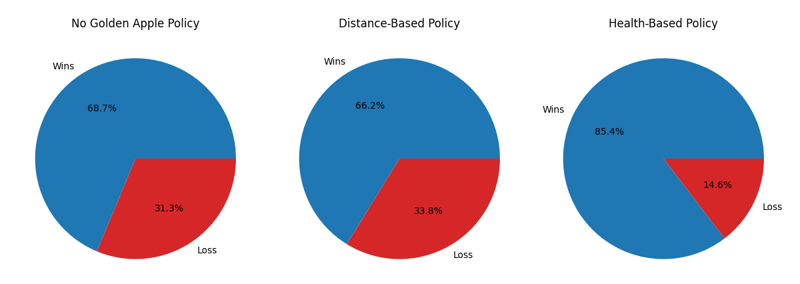
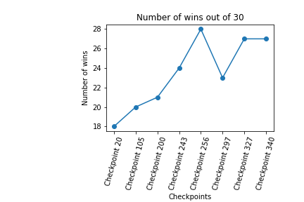
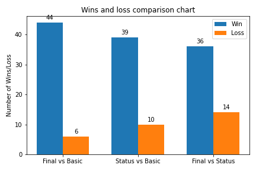
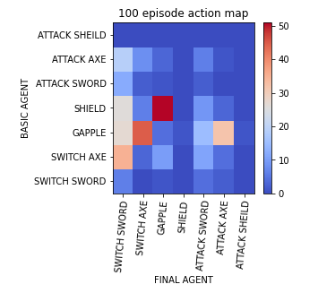

## Demonstration Video
<iframe width="560" height="315" src="https://www.youtube.com/embed/NbO2JNhUz7Q" frameborder="0" allow="accelerometer; autoplay; clipboard-write; encrypted-media; gyroscope; picture-in-picture" allowfullscreen></iframe>


## Project Summary
Combat is a very important part of Minecraft gameplay: in survival mode, players usually need to eliminate different kinds of mobs to save themselves and defend their shelters. In multiplayer mode, they will also face the threat of other players. A hardcoded computer agent may easily defeat mobs, but when it faces human players who are more flexible and intelligent, the built-in logic might not be sufficient. Thus, we created a reinforcement-learning agent in order to simulate and adapt to a flexible PvP style as much as possible.

This project is based on Malmo python and reinforcement learning to create a smart agent for fighting. We applied the modules from RLlib and started the training by fighting with a hard-coded agent which can attack with multiple weapons, defend with shield, and recover HP with golden apples. After our smart agent was able to defeat the hard-coded agent for most of the time, we made it fight with models of itself at previous checkpoints and occasionally the hard-coded agent (so that it doesn't forget it's original baseline) to keep improving its ability. During the self-play procedure, we also tried multiple approaches to fix bugs and compare the effectiveness of our changes.

Our final smart agent reached our goal to be able to defeat both the hard-coded agent that has very capable PvP strategies as well as a human player in Minecraft. This marked our success for creating a smart fighting AI for this project. It has learned many strategies such as shield breaking, emergency HP recovering, and attack cancelling.


## Approach
We are currently using the pre-implemented version of the Proximal Policy Optimization (PPO) algorithm trainer from RLLIB to train our agent. Which uses the update<br>
$$L^{CLIP}(\theta)=E[min(r(\theta)A_t, clip(r_t(\theta),1-\epsilon,1+\epsilon)A_t)] $$
Where $$r(\theta) = \frac{\pi_{\theta}(a_t|s_t)}{\pi_{\theta_{old}}(a_t|s_t)}$$ the ratio of the current policy over the old policy<br>
$$A_t = A(s,a) = Q(s,a) - V(s)$$ is the advantage function which is the Q-value subtracted by the Value at a given state.
The clip function will keep the ratio $$r(\theta)$$ between $$[1-\epsilon,1+\epsilon]$$

The environment creates two agents that are across the map from each other with a time limit of 120 seconds. Through the use of a path finding algorithm, both agents will always be able to find and look at each other. The path finding algorithm is implemented for both the hardcoded and reinforcement-learning agent as we will mainly be focusing on how the agent will use particular weapons and items.

### Baseline approach
The agent named "Fish" is a rule-based agent using many rules derived from actual PvP strategies. For example, use golden apples when low HP; time strikes based on the weapon's cooldown for maximum damage; use a shield when the enemy agent is close. Here are some more detailed rule:

**Weapon rule:**
- In general, use sword when enemy is using axe or fists, try to interrupt axe attacks
- When enemy is shielding, switch to axe and break shield
- When enemy is using sword, use sword/shield combo
- When low HP or enemy low HP, switch to axe for more damage

**Shield rule:**
- In general, don't hold shield against axe, can hold against other weapons
- When low HP, hold shield at all cost, after baiting attack, counter attack or run

**Golden apple rule:**
- When enemy is wielding axe, heal when HP < 10
- When enemy is wielding sword, heal when HP < 7.5
- Otherwise, heal when HP < 4

The agent named "Puffer" will be the reinforcement learning agent, and we decided to discretize the action space. While the observation space is continuous between 0 and 1.Thus the enemy in range observation will be 0 if the enemy is not in range and 1 otherwise. The health observations will be normalized by dividing by a factor of 20, and the enemy weapon type will be mapped as axe=1, sword=0.75, gapple=0.25, shield=0 (offensive to defensive scale)

**Action Space:**
- Attack
- Switch sword
- Switch axe
- Use golden apple
- Use shield
- IDLE

**Observation Space:**
- In range of the enemy
- current health (normalized)
- enemy health (normalized)
- enemy weapon type

**Reward Space:**
- change in health at each time step (delta_health - delta_enemy_health)
- large positive reward (+20) if the RL agent was able to kill the other agent

This rule-based agent is what we used as a baseline to evaluate the progress of our self-play agent. By running matches against it with different levels of weapon (wood, stone, iron, diamond) and armor (leather, gold, chain, iron, and diamond), we are able to evaluate the self-play agent’s proficiency in combat.


### Proposed Approach (Best Agent)
Since the reinforcement-learning agent (which we call “Puffer”) was able to defeat the rule-based agent a majority of the time, we decided to implement self-play. This was done by first having Puffer cement its baseline by fighting the rule-based agent (which we will call "Fish") for 20 checkpoints (approximately 80 episodes). After the 20 checkpoints, Puffer will have a 80% chance to fight against the previous (10 to 15 checkpoints older) checkpoint of itself and 20% chance against the rule-based agent. Fish’s model will be updated every 5 checkpoints to a more recent checkpoint of Puffer. The training then continues until we see that it has learned interesting policies.

Since we are using self-play, both agents have the same action and observation space, but only Puffer will have a reward space since it is being trained. Although the action and observation space did not change from the baseline approach, we did try different observations and rewards and saw that the best results came from adding a penalty in the reward for using the golden apple too early.

### Advantages and Disadvantages
Since self-play is built upon having an initial baseline RL agent, our proposed approach will take more time and need more data. However, an advantage to using self-play is that the RL agent no longer overfits the rule-based agent that it has trained against for so long and can learn other techniques that it has never seen before.

The rules for the baseline approach is very open-ended since we based the rules of the rule-based agent off of what we believed to be a good set of rules for pvp. As a result this can create overfitting to the rule-based agent which means our RL agent will only be able to defeat the rule-based agent. In self-play, the rule-based agent will still be used as a baseline, but the learned policy limitations are no longer bound by just the actions of the rule-based agent and we should see an increase in different pvp strategies that the RL agent will learn.

A disadvantage to self-play is that the agent may learn very bad behaviors. Because the opponent is its previous self, which is not necessarily optimal, the self-play agent could take advantage of its previous mistakes to easily win the fight. For instance, there were cases in which the self-play agent learned to only punch the opponent. Although this strategy wins because it abuses the hard coded pathing that we implemented to each agent, it would not work against a human player.

### Other Interesting Approaches
Along with self-play, we tried training different models with additional observation space for distance, or penalties for using too many random actions, but these models ended up learning very weird policies such as only defending and punching the opponent away with a shield, or just idling throughout the match.

One interesting improvement that is worth mentioning is the usage of golden apples. During the training process, we found that our agent used a gold apple as soon as it entered the arena, regenerating no health whatsoever. This was a waste of its recovery function. We tried to discourage this behavior using two different policies:

**Distance-based policy:**
```python
If distance between agents > 4 and golden apple is used:
    penalty =  -0.5 * distance between two agents
else:
    penalty = 0
```

**Health-based policy:**
```python
if agent health > 10 and golden apple is used:
    penalty = -0.5 * health
else:
    penalty = 0
```

Then we tried to test the policies by using the agents at the same checkpoint to fight against the basic agent for 30 rounds each. Here is the resulting statistics:




As the diagram showed, the agent with the distance-based policy did not have a significant edge over the one without golden apple policy, while the health-based policy had an improvement on the agent’s performance.


## Evaluation
We developed many different analysis metrics to verify that our self-play agent is on the right track. This includes both qualitative and quantitative metrics. We frequently use these analysis metrics to validate our models throughout the training process.

### Quantitative analysis
The quantitative evaluation metric of this project will be how often the rule-based agent is defeated. The baseline should be beating the agent for 75% of matches, which means that the self-play agent has at least the “smartness” of the rule-based agent. When we finally tested our smart agent, it defeated the rule-based agent 88% of the time.

**This is a chart of the wins of different checkpoint models throughout the training process. The Agent is trained using self-play and then tested against the basic agent.**




From the image above even at checkpoint 20, we already had a good performance of defeating the rule-based agent and through the process of self-play, the RL agent began to consistently score above 20 wins. The results were surprising since we do end up seeing that the self-play agent is able to beat the rule-based agent over 75% of the time and reached 88%, which greatly exceeded our expectation.<br>

<b>This is a chart of the wins to losses over 50 episodes from each of the different combinations of agents battling.</b>


The highest win rate occurs in the battle between our final agent and the basic agent. Overall, our final self-play agent defeats both the basic agent as well as the RL agent that only trained against the basic agent a majority of the time.

### Qualitative analysis
<b>This is a heatmap of the different actions and responses that our final agent had in response to the basic agent.</b>


The qualitative evaluation will be the agent’s response to different incoming actions: such as shielding or avoiding when being attacked. It is hard to judge the quality of combat, but we will try to make the AI react differently to attacks so the fight can be more exciting.

The above image shows some of the different responses that our RL agent has learned after training. There are a few noticeable actions in the plot such as eating an apple when the opponent has their shield up, which is a good idea since they are on the defense. Another action is switching to either a sword or an axe whenever the opponent decides to use their golden apple, this can be because using a golden apple leaves them vulnerable to attacks. Another common policy that it learned was to switch to a sword when the basic agent has an axe which could be because the sword is faster at attacking. Another pattern that can be seen is that the agent prefers to use the sword to attack rather than the axe, while occasionally using the axe and shield.

Although the heat mapping provides some ideas and data of the qualitative analysis, watching the agent fight in the video  provides a better demonstration of what the self-play agent has learned.

<b>The bottom screen is the self-play trained agent and the top screen is the basic agent:</b>
<iframe width="560" height="315" src="https://www.youtube.com/embed/CMIf6wUIE0U" frameborder="0" allow="accelerometer; autoplay; clipboard-write; encrypted-media; gyroscope; picture-in-picture" allowfullscreen></iframe>

In the video you can see that the self-play agent will only use the golden apple when it has taken significant damage and tries to block incoming attacks using the shield. After eating the golden apple the self-play agent also punches the rule-based agent backwards while it heals. Sometimes the self-play agent will hold out the sword and wait for the basic agent to put down the shield, but sometimes it also decides to break the shield with an axe and defeat the basic agent with the axe while the basic agent is trying to heal with a golden apple. Before the self-play, the agent would use the golden apple immediately when it sees the agent, would not knock back the opponent agent as a strategy and it would not try to block the attacks with a shield.

Another important qualitative evaluation was the fight between the agent and a human player. As a regulation, the human player should aim at the body of our smart agent and stay close to it so the agent could attack instead of chasing after its opponent and getting attacked at the edge of the melee range. Although the self-play agent might not be able to defeat experienced Minecraft players, it successfully beat a novice player. Here is a video showing the victory of Puffer over a human:
<iframe width="560" height="315" src="https://www.youtube.com/embed/Oe12fPRSS9o" title="YouTube video player" frameborder="0" allow="accelerometer; autoplay; clipboard-write; encrypted-media; gyroscope; picture-in-picture" allowfullscreen></iframe>

## Resources Used
The core of our project is reinforcement learning, we used RLlib to implement it. Assignment 2 of this class provided crucial information to set up the reinforcement learning framework.<br>
multi-agent RLLIB: <https://docs.ray.io/en/master/rllib-env.html#multi-agent-and-hierarchical> <br>
multi-agent RLLIB source code: <https://github.com/ray-project/ray/blob/master/rllib/env/multi_agent_env.py><br>
Project Malmo: <https://microsoft.github.io/malmo/0.30.0/Schemas/Mission.html> <br>
Self-play: <https://openai.com/blog/competitive-self-play/> <br>


```python

```
