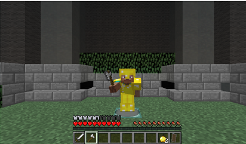

Source code: <https://github.com/OneMelon8/Pufferfish>

Our goal in this project is to create a reinforcement learning agent that can demonstrate basic strategies in player-versus-player combat such as knowing when to defend with a sheild, when to eat a golden apple to regenerate, and other interesting combinations of weapon swaps between an axe and a sword. Currently our RL Agent "Puffer" is trained against a hard-coded policy-based Agent "Fish" as a proof of concept/baseline to see whether our RL agent can learn.

**Below is our reinforcement learning agent (Agent "Puffer") who will be trained to fight against Agent "Fish"**

**Here is a clip of Agent Puffer before training:**
<iframe width="560" height="315" src="https://www.youtube.com/embed/44KwAyw-AXs" frameborder="0" allow="accelerometer; autoplay; clipboard-write; encrypted-media; gyroscope; picture-in-picture" allowfullscreen></iframe>

**Here is a clip of Agent Puffer after training overnight:**
<iframe width="560" height="315" src="https://www.youtube.com/embed/uB0HolxmnzU" frameborder="0" allow="accelerometer; autoplay; clipboard-write; encrypted-media; gyroscope; picture-in-picture" allowfullscreen></iframe>

**Reports:**
- [Proposal](proposal.html)
- [Status](status.html)
- [Final](final.html)
