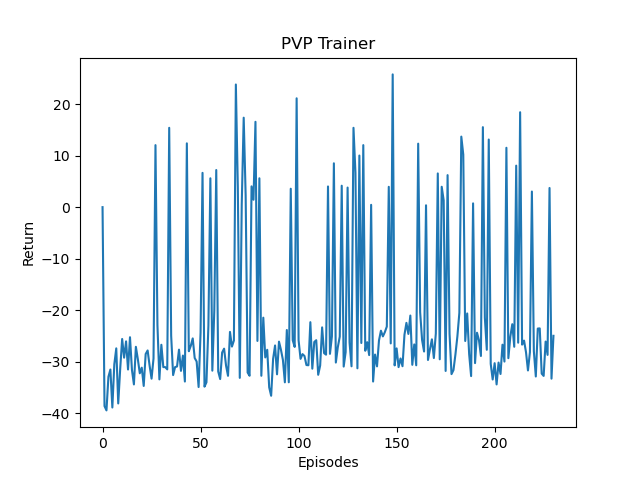
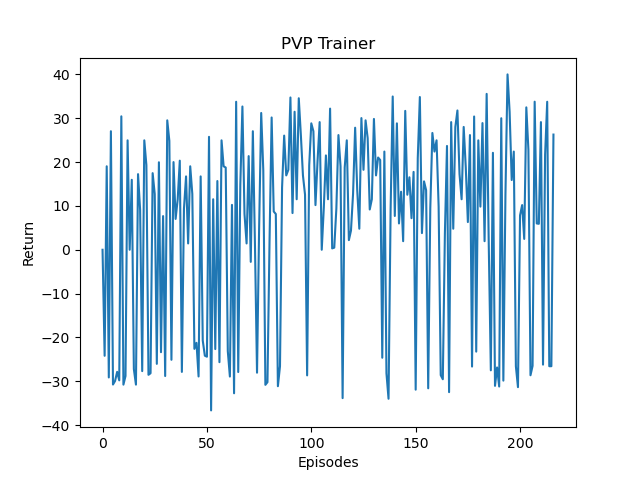

## Demonstration Video
<iframe width="560" height="315" src="https://www.youtube.com/embed/LOFqFn7dzGI" frameborder="0" allow="accelerometer; autoplay; clipboard-write; encrypted-media; gyroscope; picture-in-picture" allowfullscreen></iframe>

## Project Summary
Our goal for the project is to use reinforcement learning in order to create an agent that will learn optimal strategies for player-versus-player combat. Currently the RL agent is trained against a hard-coded policy agent that has what we believe to be good combat senses. After training the agent overnight, our RL agent has learned to defeat this hard-coded agent and our next steps are to implement a self-play environment in order to further train our RL agent to potentially be able to beat a human player.

## Approach

We are currently using the preimplemented version of the Proximal Policy Optimization algorithm trainer from RLLIB to train our agent. Which uses the update 
$$L^{CLIP}(\theta)=E[min(r(\theta)A_t, clip(r_t(\theta),1-\epsilon,1+\epsilon)A_t)] $$
Where $$r(\theta) = \frac{\pi_{\theta}(a_t|s_t)}{\pi_{\theta_{old}}(a_t|s_t)}$$ the ratio of the current policy over the old policy 
$$A_t = A(s,a) = Q(s,a) - V(s)$$ is the advantage function which is the Q-value subtracted by the Value at a given state.
The clip function will keep the ratio $$r(\theta)$$ between $$[1-\epsilon,1+\epsilon]$$

The environment creates two agents that are across the map from each other with a time limit of 120 seconds and through the use of a path finding algorithm they will always find and look towards each other. The path finding is implemented for both the hardcoded and reinforcement-learning agent as we will mainly be focusing on how the agent will use particular weapons and items.

The agent named "Fish" is a policy-based agent using many policies derived from actual PvP strategies. For example, when it is low health use golden apples, if it sees the enemy agent hit them based off of the weapon's cooldown for maximum damage, use a sheild when the enemy agent is close. Here are some more detailed policies:

**Weapon policy:**
- In general, use sword when enemy is using axe or fists, try to interrupt axe attacks
- When enemy is shielding, switch to axe and break shield
- When enemy is using sword, use sword/shield combo
- When low HP or enemy low HP, switch to axe for more damage

**Shield policy:**
- In general, don't hold shield against axe, can hold against other weapons
- When low HP, hold shield at all cost, after baiting attack, counter attack or run

**Golden apple policy:**
- When enemy is wielding axe, heal when HP < 10
- When enemy is wielding sword, heal when HP < 7.5
- Otherwise, heal when HP < 4

The agent named "Puffer" will be the reinforcement learning agent, and we decided to discretize the action space. While the observation space is continuous between 0 and 1.Thus the enemy in range observation will be 0 if the enemy is not in range and 1 otherwise. The health observations will be normalized by dividing by a factor of 20, and the enemy weapon type will be mapped as axe=1, sword=0.75, gapple=0.25, shield=0 (offensive to defensive scale)

**Action Space:**
- Attack
- Switch sword
- Switch axe
- Use golden apple
- Use sheild
- IDLE

**Observation Space:**
- In range of the enemy
- current health (normalized)
- enemy health (normalized)
- enemy weapon type

**Reward Space:**
- change in health at each time step (delta_health - delta_enemy_health)
- large positive reward (+20) if the RL agent was able to kill the other agent

For the training process we saved different models throughout intervals. We wanted the agent to be able to learn to hit and not die immediately to the hard coded agent, so we began training the RL agent with diamond armor against the hard coded agent who had leather armor. After running it over night the agent we loaded the agent but this time switched both the agent's armor to gold in order to have an even match. We once again trained it for a few hours and that is where we are currently at.
            
 
## Evaluation
First we will create a hard-coded agent with fixed actions, the AI shall play against it until it is developed enough. Then the AI will fight against its previous self (another agent) continuously to improve the quality. The quantitative evaluation metric of this project will be how often the hard-coded agent is defeated. The baseline should be beating the agent for 50% of matches, which means that the AI has at least the “smartness” of a hard coded agent. We expect it to be improved as it should be able to defeat the agent for over 75% of the plays. 
<b>Here is the returns of an agent that only began training, with the score: 
     Current Episode 231	 RL_AGENT_WINS:43	 RL AGENT_LOSSES:185</b>

The above image shows signs that the agent is learning, however it is still being defeated and losing a majority of the time. 

<b>Here is the returns of an agent that trained overnight for over 1000 matches, with the score: 
     Current Episode 217	 RL_AGENT_WINS:153	 RL AGENT_LOSSES:61</b>
    

**The score does not add up to the number of episodes due to some episodes timing out (neither agents were able to kill one another before the timer ran out) 
The two images above show the rewards that the agent gained per episode, and by looking at the second graph the RL agent is receiving a lot more positive rewards due to the fact that he is killing the agent and receiving a +20 reward. Comparing both the plots you can see that the first graph shows a lot of downward pits, while the second graph has a lot of upwards peaks. This demonstrates that the RL agent was able to begin to learn how to defeat the hard coded agent. The first graph also shows some potential learning by looking at how the average negative rewards are slowly increasing.

The qualitative evaluation will be the agent’s response to different incoming actions: such as shielding or avoiding when being attacked. It is hard to judge the quality of combat, but we will try to make the AI react differently to attacks so the fight can be more exciting.

From observing the video at the top of the page we can see that the agent, in the end, learns to use golden apples whenever his health is low and begins to learn how to consistently deal damage with either a sword or an axe rather than keep swapping his weapons. At one point he even uses his fists to deal consistent damage. 

## Remaining Goals and Challenges
Now we have developed an agent to fight with hardcoded agents. Currently the training is still processing and the winning rate is 70%. After the winning rate toward the hardcoded agent reaches 85%, the AI will be adjusted to fight with itself and continue to improve its ability through self-play. 
The AI just needed several hundreds of battles to reach a winning rate of 70%, which is comparatively easy. During the future self-playing process, the smart agent will still need to fight with the hardcoded one to guarantee the battles between AIs to improve its ability. So the biggest challenge will be improving the hardcoded agent to make it competitive again. Besides, such improvement will extend the training process and thus we can verify the effectiveness of our reinforcement learning framework. We expect the RL agent to perform better than it's current iteration through self-play but at the moment we are unsure whether it will actually improve or become worse. If the agent does end up performing worse we will try to use multiple variations of combat for the hand-coded policy agents which will hopefully bring it to the point where it is able to defeat a human player. 

## Resources Used
The core of our project is reinforcement learning, we used RLlib to implement it. Assignment 2 of this class provided crucial information to set up the reinforcement learning framework. 
multi-agent RLLIB: <https://docs.ray.io/en/master/rllib-env.html#multi-agent-and-hierarchical>  
multi-agent RLLIB source code: <https://github.com/ray-project/ray/blob/master/rllib/env/multi_agent_env.py> 
Project Malmo: <https://microsoft.github.io/malmo/0.30.0/Schemas/Mission.html>  
